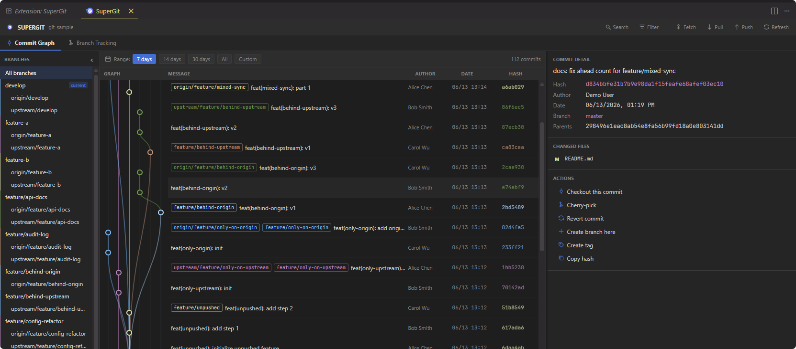
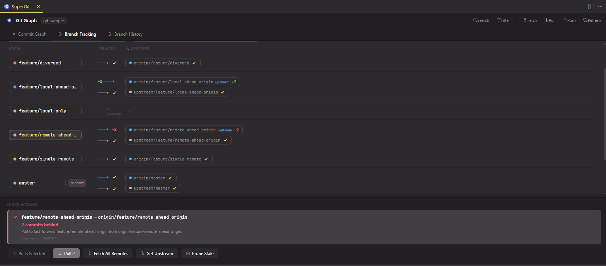
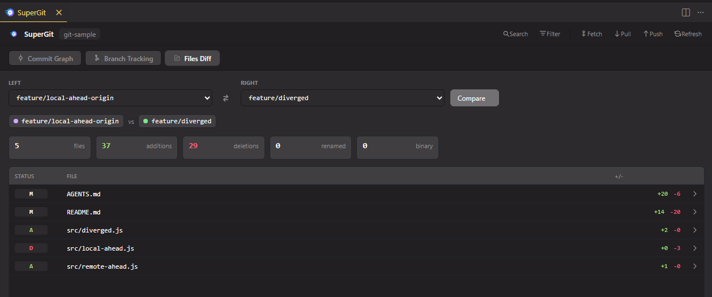

# SuperGit

SuperGit is a VS Code extension for visual Git history, branch-to-remote tracking, and branch file comparisons. It opens a VS Code-native webview with a commit graph, branch tracking diagram, files diff tab, multi-remote status, date/search controls, and guarded Git actions.

## Screenshots

### Commit Graph



### Branch Tracking



### Files Diff



## Features

- Commit graph with topology swimlanes, merge nodes, refs, tags, author/date/hash columns, and commit detail panel.
- Files Diff tab for comparing two local or remote branch refs with changed-file totals and per-file VS Code diff opening.
- Date range filters for 7 days, 14 days, 30 days, All, and custom ranges.
- Search by commit message, hash, author, branch refs, and tags.
- Branch tracking view for local branches across multiple remotes with default-branch indicators.
- Ahead/behind badges, synced state, and no-upstream indicators.
- Quick actions for fetch, pull, push, set upstream (multi-remote QuickPick), and prune stale refs.
- Commit actions for checkout, cherry-pick, revert, create branch, create tag, and copy hash.
- Bottom status-bar entry: `$(git-commit) SuperGit`.

## Opening SuperGit

After installing the VSIX, open a Git repository in VS Code, Cursor, or a compatible VS Code fork.

You can open SuperGit in any of these ways:

- Click `SuperGit` in the bottom status bar.
- Run `SuperGit: Show Graph` from the Command Palette.
- Use the SCM title-bar command.

If the status-bar item is not visible immediately after install, reload the window once. The extension activates on startup, when a workspace contains `.git`, and when the command is invoked.

## Debugging

If clicking the status-bar button does not open the UI, enable SuperGit debug logging and retry the click.

Enable debug logging from Settings JSON:

```json
{
  "superGit.debug": true
}
```

Or run:

```text
SuperGit: Toggle Debug Logging
```

Then open the logs:

```text
SuperGit: Show Logs
```

Check the `SuperGit` output channel for entries such as:

- activation and status-bar registration
- `superGit.show` command invocation
- webview panel creation
- webview resource URI creation
- webview HTML, bundle, and React app startup
- repository discovery
- Git command execution and failures

The same errors are also sent to the VS Code Extension Host log.

## Git Behavior

SuperGit uses VS Code's built-in Git extension for repository discovery and Git binary resolution, then runs Git CLI commands for graph and tracking data.

Read-only commands include:

- `git log --all --date-order`
- `git for-each-ref`
- `git rev-list --left-right --count`
- `git diff --name-status --numstat`
- `git remote -v`

Write actions are guarded with VS Code confirmation prompts. SuperGit sets `GIT_TERMINAL_PROMPT=0`, so Git commands will not hang waiting for terminal credentials.

## Requirements

- VS Code `^1.100.0`
- Built-in VS Code Git extension enabled
- Git repository opened as the workspace folder
- Git available from VS Code's Git configuration or system `PATH`

## Development

Use the system npm if your local `npm` is a shim:

```bash
/usr/bin/npm install
/usr/bin/npm run typecheck
/usr/bin/npm run test:coverage
/usr/bin/npm run build
/usr/bin/npm run package
```

The packaged extension is written to:

```text
supergit-<version>.vsix
```

where `<version>` is the `"version"` field in `package.json`.

## Verification Status

Current local verification:

- TypeScript typecheck passes.
- Unit tests pass: 169 tests.
- Coverage passes the design target for `src/git/*.ts`.
- VSIX packaging passes and includes `CHANGELOG.md`, `README.md`, `LICENSE`, `assets/icon.png`, `assets/logo.png`, `assets/CommitGraph.png`, `assets/BranchTracking.png`, `assets/FilesDiff.png`, bundled extension/webview JavaScript, and CSS.

`npm run test:integration` requires a desktop-capable VS Code/Electron environment. In the current managed container, Electron exits before extension load due to sandbox/display restrictions.
